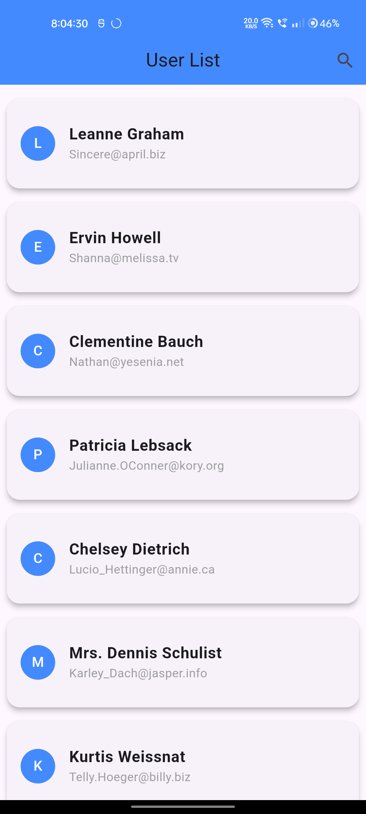
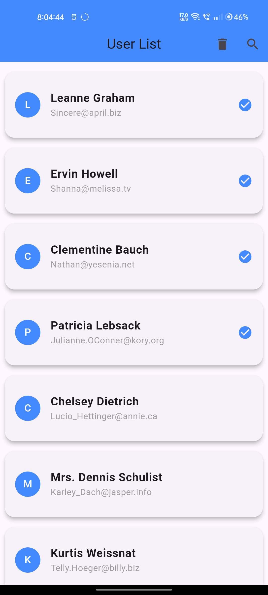
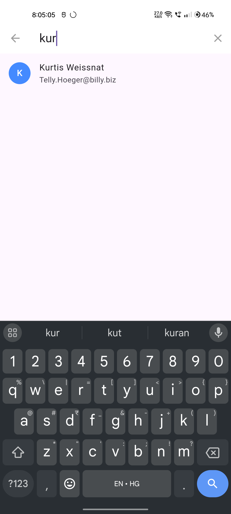
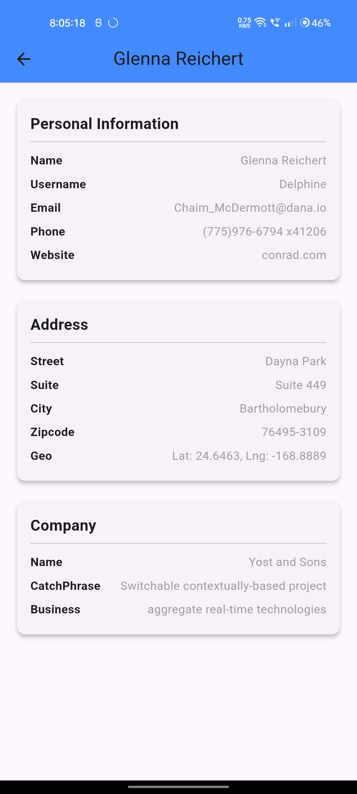

# contacts_app

## Project Title

**Contacts App**

This is a Flutter application that allows users to view, search, and manage their contacts. Users can perform basic operations like viewing contact details and searching contacts by name or email. The app also supports a multi-select mode for bulk actions like deleting multiple contacts.

## Project Description

The **Contacts App** is designed to help users manage their contacts effectively on a mobile device. It supports features like searching contacts, viewing detailed information for each contact, and multi-select functionality for actions like deleting selected contacts.

### Features:
- View contacts with their names and email addresses.
- Search contacts by name or email.
- Long press on a contact to enter multi-select mode.
- Bulk delete contacts using a delete button in the app bar.
- Refresh contacts list via pull-to-refresh functionality.

## Getting Started

To get started with this project, you'll need to have Flutter installed on your machine.

### Prerequisites

Before you run the app, ensure you have the following installed:
- [Flutter](https://flutter.dev/docs/get-started/install)
- [Android Studio](https://developer.android.com/studio) (or any IDE with Flutter plugin)
- An emulator or physical device to run the app

### Installation

1. Clone the repository to your local machine:
   ```bash
   git clone https://github.com/yash9111/Contacts-app-.git
2. Navigate to the project directory:
   ```bash
   cd contacts_app
3. Install the required dependencies:
   ```bash
   flutter pub get
4. Run the app on your desired device or emulator:
   ```bash
    flutter run
The app will launch on the connected device or emulator, allowing you to interact with it.

### Assumptions and Decisions Made During Development

**State Management**: This app uses flutter_bloc for state management to handle the loading, error, and success states related to contacts fetching and management.

**Contacts API**: The app fetches a list of contacts (mocked or fetched from an API) and displays them. I assumed that the contacts are stored with basic information like name and email.

**UI Design**: The user interface has been designed to ensure ease of navigation. The app bar contains a search icon, and contacts are displayed in a list with a long press option to enter multi-select mode.

**Multi-Select Mode**: Long-pressing a contact enters multi-select mode, where multiple contacts can be selected for bulk actions. A delete button appears on the app bar when in multi-select mode.

**Error Handling**: Basic error handling is implemented to show a snack bar in case of a failure while fetching contacts.

**Search Functionality**: The search function allows users to filter contacts by name or email in real-time.

## Screenshots

### Home Screen


### Multi-Select Mode


### Search Functionality


### Contact Detail Screen



## You can find working demo of the app [here](https://drive.google.com/file/d/1uGMJGO4o15BlQ2Dwa_o6fEbR5_lV8QHs/view?usp=sharing)